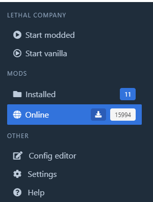
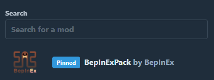
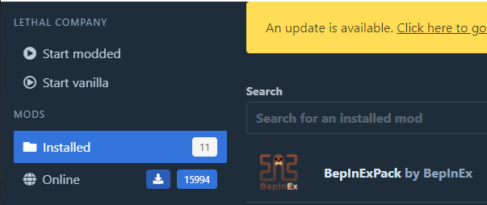

# Как установить [моды](https://ru.wikipedia.org/wiki/%D0%9C%D0%BE%D0%B4%D0%B8%D1%84%D0%B8%D0%BA%D0%B0%D1%86%D0%B8%D1%8F) для `Lethal company 💀`

### Требования ⬇️
* Наличие хорошего компьютера
* Наличие [возраста](https://ru.wikipedia.org/wiki/%D0%92%D0%BE%D0%B7%D1%80%D0%B0%D1%81%D1%82) >= 25 лет
* Наличие хорошего [настроения](https://ru.wikipedia.org/wiki/%D0%9D%D0%B0%D1%81%D1%82%D1%80%D0%BE%D0%B5%D0%BD%D0%B8%D0%B5)
* Наличие свободного места на [ПЗУ](https://ru.wikipedia.org/wiki/%D0%9F%D0%BE%D1%81%D1%82%D0%BE%D1%8F%D0%BD%D0%BD%D0%BE%D0%B5_%D0%B7%D0%B0%D0%BF%D0%BE%D0%BC%D0%B8%D0%BD%D0%B0%D1%8E%D1%89%D0%B5%D0%B5_%D1%83%D1%81%D1%82%D1%80%D0%BE%D0%B9%D1%81%D1%82%D0%B2%D0%BE) в размере *4294967296 Бит*

### Доп. Требования ⬇️
* Установленная программа [r2modman](https://thunderstore.io/package/ebkr/r2modman/)
* Чистая версия игры `Lethal company`

### Используемые ресурсы ⬇️
* Менеджер модов - `r2modman`
* Сервис с модами - `thunderstore.io`

### Алгоритм ⬇️
1. Установить чистую игру `Lethal company`
2. Скачать менеджер модов `r2modman`
3. Запустить менеджер модов
4. Указать стандартную игру для модифицирования (`Lethal company`)
5. Выбрать стандартный профиль
6. Перейти на вкладку `Online`

    
7. Воспользоваться поисковой строкой для выборки модов

    

8. После нахождения нужной модификации установить через нажатие кнопки `Download`

    
9. После этого установленная модификация появится в списке `Installed`

    
10. Запуск модифицированного клиента осуществляется через нажатине кнопки `Start modded`
11. Profit

### Послесловие ⬇️
```ts
enum MoodType {
    nice = 0
    deadInside = 1
}

class Mood {
    mood: MoodType

    constructor(mood: MoodType) {
        this.mood = mood
    }
}

class Team {
    players: string[]

    constructor(players: string[]) {
        this.players = players
    }
}

class Game {
    team: Team
    mood: Mood

    constructor(team: Team, mood: Mood) {
        this.team = team
        this.mood = mood
    }

    public async playTheGame(): Promise<void> {}
}

const mood = new Mood(MoodType.nice)
const team = new Team(['Nik', 'Slave', 'Billy', 'Alexy'])
const game = new Game(team, mood)

game.playTheGame()

```